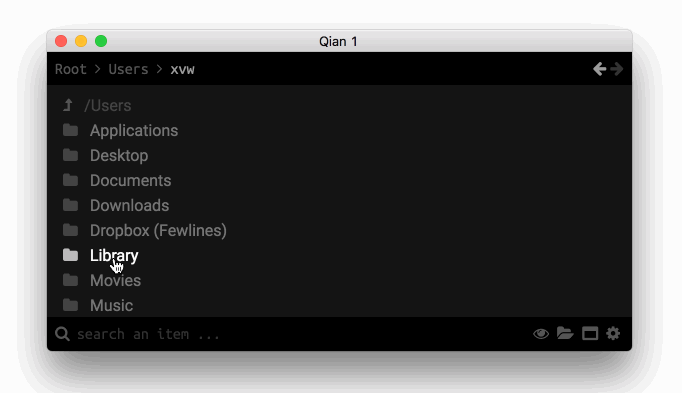

# Qian (wip)

> Qian is an hackable **micro File explorer** for **OSX**, written in **Elm** and
> **Electron**. The name **Qian** come from the name of
> [Zhang Qian](https://en.wikipedia.org/wiki/Zhang_Qian), a Chinese
> explorer. (aha get it ?)

## Tl;dr

Since I'm on Mac, I mainly use the terminal to navigate my files because
I do not like much Finder (I don't really have any arguments ...).
So I decided to build a small file explorer (mainly to navigate my documents)
that would fit perfectly to **my needs**.

I used **Elm** because I wanted to learn how to use it, and **Electron**
because I want to prototype quickly.

## Philosophy

The main goal of this project is not to create a revolutionary software.
Just build a useful software for me. The idea is to implement features only
**when I need them**.

If you see any changes to the code, do not hesitate to make an issue or pull-request!
In addition, if a feature seems interesting to implement, let's talk about it in an issue!

## Usage

-  `npm install -g elm` (to install Elm)
-  `make install` to fetch the NPM dependancies
-  `make build` to build the application
-  `make run` to run the buildt application
-  `make` (a combo of `make build` and `make run`)
-  `make app` to create a runnable app on OSX

## Credits

-  [@radmen](https://github.com/radmen): add the support of Fuzzy-Search (using
   a NoRedink's package)
-  [@julien-leclercq](https://github.com/julien-leclercq): Makefile improvement
-  [@xvw](https://github.com/xvw): everything else... (I think :P)

### Tools

-  [Dotgrid](http://wiki.xxiivv.com/#dotgrid) (for the logo)
-  [Elm](http://elm-lang.org/) (to have a nice language)
-  [Electron](https://electron.atom.io/) (to have a window !)
-  [Font Awesome](http://fontawesome.io/) (for the icon in the UI)
-  [NoRedInk Simple Fuzzy](http://package.elm-lang.org/packages/NoRedInk/elm-simple-fuzzy/latest)
   (for the Fuzzy Searching)
